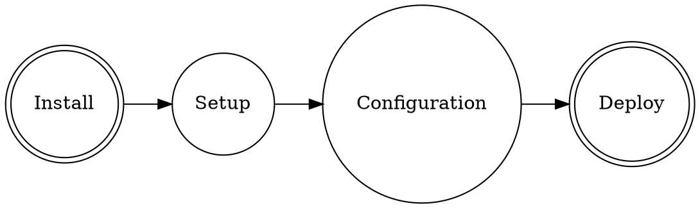

使用 Hexo 创建一个博客需要4大步骤。前3步骤不赘述，相关问题搜索引擎都能搞定。我踩坑最多的是最后一步，所以这里就分享下最后一步遇到的问题。



## Install

需要安装的软件列表：

- Git
- NPM
- Hexo

## Setup

```bash
npm install hexo-cli -g
hexo init blog
cd blog
npm install
hexo server
```

## Configuration

### Hexo 和 Theme 配置

### Github 配置

## Deploy

前3大步骤顺利的情况下，博客系统就可以在本地被测试了。为了上线这个博客系统，还需要了解Hexo是如何与Github一起把这个博客系统跑起来的。

### Source

### 网站静态文件