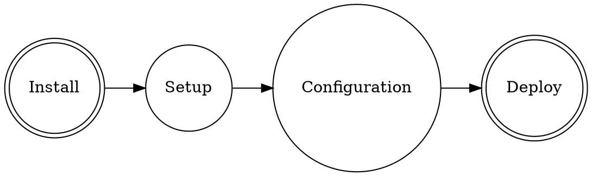

使用 Hexo 创建一个博客需要4大步骤。前3步骤不赘述，相关问题搜索引擎都能搞定。我踩坑最多的是最后一步，所以这里就分享下最后一步遇到的问题。



## Install

需要安装的软件列表：

- Git
- NPM
- Hexo

## Setup

```bash
npm install hexo-cli -g
hexo init blog
cd blog
npm install
hexo server
```

## Configuration

### Hexo 和 Theme 配置

### Github 配置

## Deploy

前3大步骤顺利的情况下，博客系统就可以在本地被测试了。为了上线这个博客系统，还需要了解Hexo是怎么配合Github部署博客。

默认情况下，`hexo deploy`命令只会部署博客的源文件到Github仓库上。本地的博客静态文件并没有部署到Github仓库中。这就导致使用`hexo deploy`命令并不能完成博客静态文件的部署，那么浏览器中也就无法访问博客。

所以，实际的部署分两步骤：
1. 博客的源文件部署
2. Github根据博客的源文件自动生成一个博客静态文件的分支，根据博客仓的设置将仓的Github Pages指向这个分支。

### Source

```
git add .
git commit -m "change log"
git push
```

### 博客静态文件

那么Github如何根据源文件自动生成一个博客静态文件的分支呢？答案是使用[Github Actions](https://github.com/features/actions)。当Github根据博客的源文件自动生成一个博客静态文件的分支时，自然就不需要依赖本地机器上生成的静态文件了。

为了让Github为我们自动完成分支的生成和提交，需要在`./.github/`下创建一个目录`./.github/workflows`，并在这个目录下创建一个自动化任务`./.github/workflows/pages.yml`。

